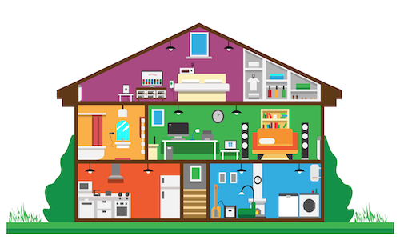

# Visualization of the electricity consumption of a household

The need to protect our planet and reduce our impact on the environment is becoming more and more urgent, and requires our daily attention. Each person can act at their level and especially at their home. In this project, we are interested in the electricity consumption of of every device in a household in France. We want to consider everyday devices in order to provide precise and quantitative information on their ecological impact. The main objective of this project is to provide a tool allowing families to know which devices consume the most, and therefore on which ones they need to act first.

## Getting Started

The visualization of our project can be explored on the following website [Link](https://ccspteam.github.io).
```
https://ccspteam.github.io
```


## Built With

* [D3 JS](https://d3js.org) - The JavaScript framework for data manipulation and visualization

## Authors

* **Pierre Cabanis** - [Github Page](https://github.com/PierreCabanis)

* **Steeven Janny** - [Github Page](https://github.com/SteevenJ7)

* **Claire Pillet** - [Github Page](https://github.com/ClairePillet)

* **Cyril Reymond** - [Github Page](https://github.com/creymond)
